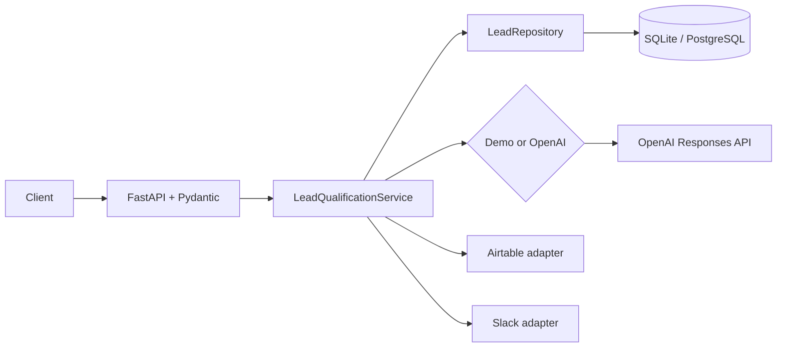

# Architecture

The API follows a ports-and-adapters style. FastAPI validates transport input and delegates to `LeadQualificationService`. The service owns idempotency, qualification orchestration, priority-based notification policy, persistence, and graceful integration degradation. SQLAlchemy hides storage behind `LeadRepository`; OpenAI, Airtable, and Slack are replaceable adapters.

## Request lifecycle

1. Pydantic rejects malformed or oversized input.
2. The repository checks `external_id`; a hit is returned without side effects.
3. The configured qualifier returns a schema-validated result.
4. Optional integrations run and failures become warnings, not request failures.
5. The result is committed under a unique database constraint. A concurrent uniqueness conflict is re-read as an existing result.

For a production system, reserve the idempotency key before external work or use a transactional job/outbox. The MVP's unique constraint protects storage, while the early lookup prevents normal duplicate side effects.
